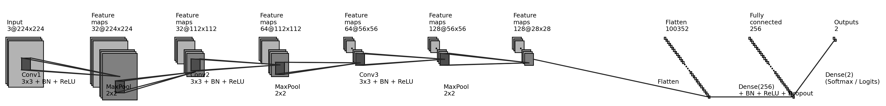

# **SkinBridge-Lite: Pipeline End-to-End de Preprocesamiento y Entrenamiento CNN desde Cero**

Este repositorio implementa un flujo de trabajo integral orientado al **análisis, modelado y despliegue de un sistema de detección de melanomas mediante redes neuronales convolucionales (CNN)**.
El proyecto aborda todas las etapas del ciclo de vida de un modelo de machine learning aplicado a imágenes médicas: desde el preprocesamiento de datos y la definición de arquitecturas, hasta la evaluación cuantitativa, la interpretabilidad y el despliegue operativo en un entorno contenedorizado.

El trabajo se desarrolló bajo la restricción de **no emplear arquitecturas preentrenadas** (como ResNet, EfficientNet o DenseNet). Por tanto, se diseñó una arquitectura CNN personalizada, optimizada para la naturaleza de los datos disponibles y para su ejecución eficiente en entornos con recursos limitados.

## **Estructura del proyecto**

La **presentación final del caso de uso** se encuentra disponible en:
[Presentación final del caso de uso: *Detección de Melanomas*](results/Caso01__Detección_Melanomas.pdf)

```bash
/config         Configuraciones globales y parámetros de ejecución
/.cache         Datos crudos, preprocesados y resultados intermedios
/docs           Documentación técnica y diagramas de arquitectura
/notebooks      Experimentación, validación visual y exploración
/results        Métricas, curvas de aprendizaje, reportes y presentación final
/src            Código fuente (preprocesamiento, entrenamiento, métricas)
/streamlit_app  Código de la aplicación interactiva y componentes de interfaz
/tests          Pruebas unitarias y de rendimiento, incluyendo validaciones GPU
Dockerfile, .dockerignore, Makefile, pyproject.toml, requirements.txt
```

## **Arquitectura del modelo**

El modelo implementa una **red neuronal convolucional desarrollada desde cero**, con una estructura modular orientada a la clasificación binaria o multiclase.
La arquitectura está compuesta por:

* Tres bloques convolucionales secuenciales con normalización por lotes y funciones de activación ReLU.
* Capas de *pooling* y regularización mediante *dropout*.
* Bloque final de *Global Average Pooling* seguido de una capa densa con activación *softmax*.
* Compatibilidad con entradas de tres o cuatro canales (RGB o RGB+H/S) según el preprocesamiento aplicado.

El diseño prioriza la interpretabilidad y la eficiencia. Se incorporaron técnicas de visualización de activaciones (Grad-CAM) para el análisis cualitativo de resultados.

`

## **Flujo de trabajo**

1. **Preprocesamiento de datos**
   * Limpieza de artefactos (vello, sombras, bordes).
   * Segmentación de lesiones y normalización de intensidad.
   * Generación de canales cromáticos adicionales (RGB+H, RGB+S).
   * Augmentaciones geométricas y cromáticas ligeras.

2. **Construcción y entrenamiento del modelo**
   * Implementado en `train_run.py` con TensorFlow/Keras.
   * Entrenamiento supervisado con validación cruzada, control de tasa de aprendizaje y *early stopping*.
   * Registro de métricas (pérdida, exactitud, AUC) y almacenamiento estructurado de resultados.

3. **Evaluación y análisis**
   * Curvas ROC-AUC, matrices de confusión y gráficos de convergencia generados automáticamente (`metrics.py`).
   * Exportación de resultados en formato JSON y gráficos en `results/`.
   * Validación visual de gradientes y activaciones mediante Grad-CAM.

4. **Despliegue y operación**
   * Interfaz implementada en Streamlit para visualización e inferencia.
   * Configuración de contenedores Docker para despliegue local o en la nube (Hugging Face Spaces).
   * Integración del modelo final alojado en Hugging Face Hub.

## **Entornos de ejecución**

El proyecto utiliza **dos entornos de trabajo diferenciados** con fines específicos:

1. **Entorno de desarrollo y entrenamiento (Poetry)**
   * Gestionado mediante `pyproject.toml` y `poetry.lock`.
   * Incluye dependencias para TensorFlow, PyTorch y bibliotecas auxiliares de entrenamiento.
   * Configurado para aprovechar aceleración por GPU mediante CUDA, permitiendo el reentrenamiento del modelo en entornos con soporte de hardware especializado.
   * En la carpeta `/tests` se incluyen scripts de validación que verifican la correcta detección y utilización de la GPU.

2. **Entorno de despliegue de la aplicación (`requirements.txt`)**
   * Contiene únicamente las dependencias necesarias para la ejecución de la interfaz Streamlit.
   * Permite construir una imagen Docker ligera y reproducible, separada del entorno de entrenamiento.
   * Facilita la portabilidad de la aplicación hacia entornos de inferencia (local o nube) sin incluir bibliotecas de alto peso computacional.

Esta separación garantiza reproducibilidad, control de versiones y optimización de recursos entre las fases de desarrollo, experimentación y despliegue.

## **Instalación**

### **Entorno de desarrollo y entrenamiento**

```bash
# Crear el entorno gestionado con Poetry
poetry install

# Activar el entorno
poetry shell

# Verificar acceso a GPU: Tensorflow o PyTorch (opcional)
python tests/smoke_gpu_pt.py
python tests/smoke_gpu_ts.py
```

### **Entorno de despliegue de la aplicación**

```bash
# Crear entorno virtual ligero
python -m venv .venv
source .venv/bin/activate  # o .venv\Scripts\activate en Windows
pip install -r requirements.txt
```

#### **Ejecución de la aplicación local**

```bash
streamlit run streamlit_app/App.py
```

#### **Construcción y despliegue con Docker**

```bash
docker build -t cancer-ai-app .
docker run -p 8501:8501 cancer-ai-app
```

## **Evaluación y resultados**

* Métricas de desempeño: pérdida, exactitud, ROC-AUC y matriz de confusión.
* Resultados cuantitativos y gráficos disponibles en el directorio `results/`.
* Registro automático de configuración, pesos del modelo y trazabilidad de cada ejecución.

[](results/Caso01__Detección_Melanomas.pdf)

## **Licencia**

El proyecto se distribuye bajo la **licencia MIT**.
Consulte el archivo `LICENSE` para obtener los términos completos.
